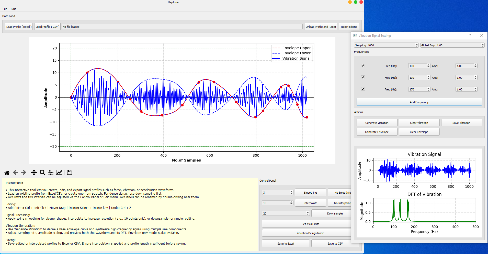

# HapTune: An Open-Source Visual Tool for Designing User-Defined Haptic Signals

**HapTune** is an open-source visual authoring tool that enables no-code creation, editing, and export of mechanical haptic signals. It supports both low-frequency force profiles and high-frequency vibration waveforms, making it ideal for haptic feedback design, robotic control, and virtual texture rendering.



---

## 🚀 Features

* 🎛️ Visual, no-code interface for **creating and editing** haptic signal waveforms  
* 🔁 Real-time **spline interpolation** and smoothing for precise curve shaping  
* ⬇️ **Downsampling** of dense waveforms to simplify editing and manual tuning 
* 🎚️ Multi-frequency **vibration synthesis** using envelope-based amplitude modulation  
* 📊 Live **frequency spectrum preview** using Fast Fourier transform (FFT)  
* 📁 Import and export of waveform data in **Excel and CSV** formats  
* 🔧 Export-ready signals for deployment on **haptic actuators** (e.g., Haptuator, torque simulator)  
* 💡 Designed for **researchers, engineers, and UI/UX designers** working in haptics and robotics.

---

## 📦 Installation

### 🔧 Requirements

* Python 3.8+
* pip

### 🧪 Create a fresh environment (recommended)

```bash
conda create -n haptune_env python=3.8
conda activate haptune_env
```

### 📥 Install dependencies

```bash
pip install -r requirements.txt
```

### ▶️ Run HapTune

```bash
python haptune_main.py
```

---

## 📂 Repository Structure

```
HapTune/
├── .docs/                     # Internal development and authorship logs
├── example_haptic_signals/    # Sample Excel/CSV profiles
├── figs/                      # UI screenshots and plots
├── haptune_main.py            # Main application entry point
├── requirements.txt           # Required Python packages
├── README.md                  # This file
├── LICENSE                    # Apache 2.0 License
├── AUTHORS.md                 # Credits and authorship
```

---

## 💡 Use Cases

* Haptic rendering for **robotic arms**, **grippers**, or virtual manipulators  
* Simulated **material textures** on touchscreens for surface perception studies  
* Designing **button click waveforms** for realistic tactile feedback in devices  
* Creating custom **thermal feedback signals** for heat flux simulation or transfer experiments  
* Prototyping and evaluating **force-feedback interfaces** in automotive, VR, or assistive systems  
* Teaching, research, or **experimentation in signal design and perceptual tuning**


---
## 📑 License

HapTune is licensed under the **Apache License 2.0**. See the [LICENSE](LICENSE) file for full terms.

> 🔒 **Intended Use Notice:**  
> Although the software is Apache-licensed, it is primarily intended for **academic research and non-commercial applications**. For commercial use or licensing inquiries, please contact the author directly.

---

## 👨‍🔬 Authors

See [AUTHORS.md](AUTHORS.md) for a full list of contributors and roles.

HapTune originated from academic research conducted at **Kyung Hee University**.  
It was developed and programmed by **Mudassir Ibrahim Awan** as part of his PhD research, with academic supervision by **Prof. Seokhee Jeon** during the early stages.

---

## 🌍 Citation / Demo Submission

A demonstration of this tool has been submitted to **World Haptics Conference 2025**. For citation details, please contact the author or check the official publication (if accepted).

---

## ✉️ Contact

For questions, feedback, or academic inquiries:

* Mudassir Ibrahim Awan
* [Scholar](https://scholar.google.com/citations?hl=en&user=DJKWlwoAAAAJ) | [LinkedIn](https://www.linkedin.com/in/mudassir-awan/) | [Twitter or X](https://x.com/mudassirIA) 
