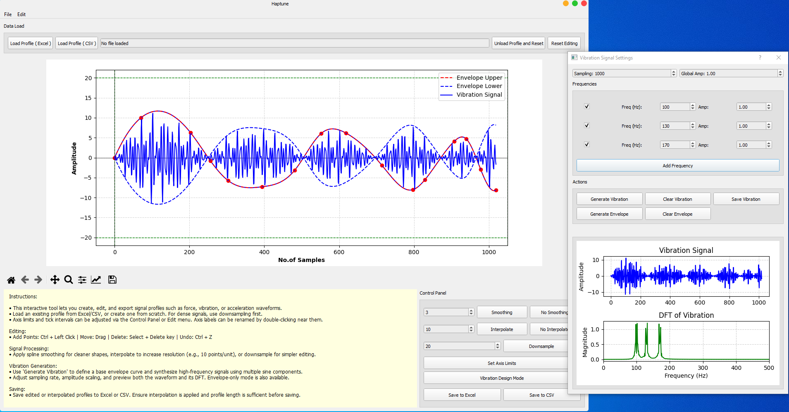

# HapTune: An Open-Source Visual Tool for Designing User-Defined Haptic Signals

**HapTune** is an open-source visual authoring tool that enables no-code creation, editing, and export of mechanical haptic signals. It supports both low-frequency force profiles and high-frequency vibration waveforms, making it ideal for haptic feedback design, robotic control, and virtual texture rendering.



---

## 🚀 Features

* 🎛️ Visual, no-code interface for **creating and editing** haptic signal waveforms  
* 🔁 Real-time **spline interpolation** and smoothing for precise curve shaping  
* ⬇️ **Downsampling** of exisitng dense waveforms to simplify editing and manual tuning
* 🎚️ Multi-frequency **vibration synthesis** using envelope-based amplitude modulation  
* 📊 Live **frequency spectrum preview** using Fast Fourier transform (FFT)  
* 📁 Import and export of waveform data in **Excel and CSV** formats  
* 🔧 Export-ready signals for deployment on **various haptic and feedback actuators**  
   (e.g., vibration motors, thermal modules, force-feedback systems, voice-coil actuators, electro-tactile displays)


* 💡 Designed for **researchers, engineers, and UI/UX designers** working in haptics and robotics.

---

## 📦 Installation

### 🔧 Requirements

* Python 3.8+
* pip

### 🧪 Create a fresh environment (recommended)

```bash
conda create -n haptune_env python=3.8
conda activate haptune_env
```

### 📥 Install dependencies

```bash
pip install -r requirements.txt
```

### ▶️ Run HapTune

```bash
python haptune_main.py
```

---

## 📂 Repository Structure

```
HapTune/
├── .docs/                     # Internal development and authorship logs
├── example_haptic_signals/    # Sample Excel/CSV profiles
├── figs/                      # UI screenshots and plots
├── haptune_main.py            # Main application entry point
├── requirements.txt           # Required Python packages
├── README.md                  # This file
├── LICENSE                    # Apache 2.0 License
├── AUTHORS.md                 # Credits and authorship
```

---

## 💡 Use Cases

* Haptic rendering for **robotic arms**, **grippers**, or virtual manipulators  
* Simulated **material textures** on touchscreens for surface perception studies  
* Designing **button click waveforms** for realistic tactile feedback in devices  
* Creating custom **thermal feedback signals** for heat flux simulation or transfer experiments  
* Prototyping and evaluating **force-feedback interfaces** in automotive, VR, or assistive systems  
* Teaching, research, or **experimentation in signal design and perceptual tuning**


---

## 🌍 Citation / Demo Submission
A demonstration of this tool has been accepted at World Haptics Conference (WHC) 2025. Since demonstration papers are not formally archived, a citable archival version has been made available via [Zenodo](https://doi.org/10.5281/zenodo.16355705).

This Zenodo record serves as a persistent reference for the demo and associated software.


```
@misc{awan_2025_16355705,
  author    = {Awan, Mudassir Ibrahim and Jeon, Seokhee},
  title     = {HapTune: An Open-Source Visual Tool for Designing User-Defined Haptic Signals},
  year      = {2025},
  month     = jul,
  publisher = {Zenodo},
  doi       = {10.5281/zenodo.16355705},
  url       = {https://doi.org/10.5281/zenodo.16355705}
}
```
---

## 📑 License

HapTune is licensed under the **Apache License 2.0**. See the [LICENSE](LICENSE) file for full terms.


<!--
---
## 👨‍🔬 Authors

HapTune was developed by **[Mudassir Ibrahim Awan](https://scholar.google.com/citations?user=DJKWlwoAAAAJ)** to provide the haptics community with a no-code tool for rapid custom haptic signal design and testing.

> 🧭 Acknowledgments:  
> Special thanks to **[Prof. Seokhee Jeon](http://haptics.khu.ac.kr/jeon/)** for his guidance during the development phase of this tool.

-->

---

## ✉️ Contact

For questions, suggestions, or feedback:

Open an issue in the [GitHub Issues](https://github.com/mudassir-awan/HapTune/issues) section of this repository.
